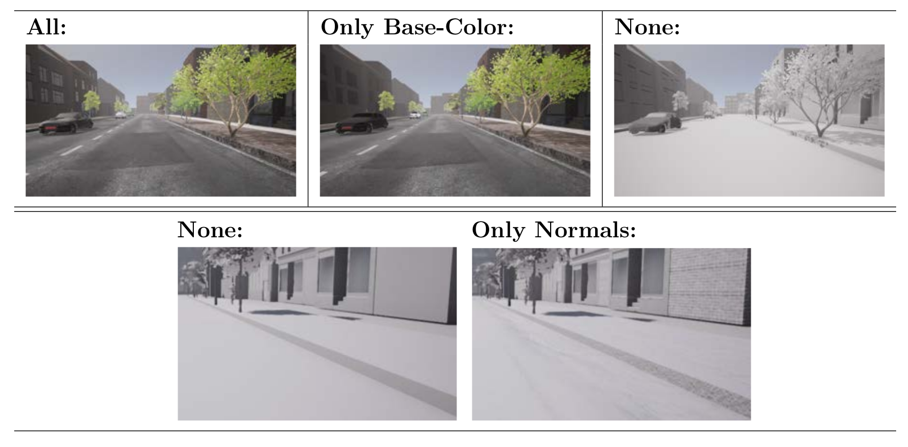

# Endless-CL-Simulator Source
The __source-code__ for our __Endless-CL-Simulator__ is part of the following publication:

> 	__A Procedural World Generation Framework for Systematic Evaluation of Continual Learning__,
>	Timm Hess, Martin Mundt, Iuliia Pliushch, Visvanathan Ramesh.

Please cite our work if you make use of this repository.

## About this open-source contribution
In this repository further insights into the technical realization of our simulator in UnrealEngine4 are provided, giving access to the source-code and an overview of the individual components and their interrelations. As such, prerequisites for 3D-assets, preparation of environmental lighting and weather components, the camera setup, and the material setup, are detailed in the following sections below. The simulator’s main-loop is unfolded with a detailed descriptions of its subroutines, including the essential aspect of capturing the images from the engine’s rendering pipeline at real-time, and the management of the procedural process.

## Disclaimer
The code in this repository is the source for the stand-alone executable we provided [__here__](https://doi.org/10.5281/zenodo.4899294). 
The source-code itself is not a fully functional project. Please refer to the executable for this purpose. The rationale is that essential assets needed to be removed to adhere to third-party licenses, which do not allow us to re-distribute these assets in their source form. In the executable simulator these assets have been included in an encrypted version, that is usable, but cannot be extracted for use beyond our simulator. However, we do include a [list of asset and tool sources](##List-of-Sources-for-used-Asset-and-Tools).

Nevertheless, we have decided to lay open the core mechanisms of our simulator to allow extension to the code base. We bevieve this to be beneficial as a basis for extension, given a reasonable amount of involved work and prior experience with UnrealEngine 4.


## Prerequisites
Working with these project files requires WindowsOS 10 and Unreal Engine 4.26 with VisualStudio to compile C++ projects.


# Technical Realization and Implementation Detail

## Outline
* [__Preparation of the Simulator (3D Assets)__](##Preparation-of-the-Simulator-(3D-Assets))
* [__Camera and Rendering-Modes__](##Camera-and-Rendering-Modes)
* [__Lighting and Weather__](##Lighting-and-Weather)
* [__Materials for Render Decomposition__](##Materials-for-Render-Decomposition)
* [__Interface to the Generative-Model (Manager-Units)__](##Interface-to-the-Generative-Model-(Manager-Units))
* [__Main Loop__](##Main-Loop)
* [__Tile Management__](##Tile-Management)
* [__Capturing Images to Disk__](##Capturing-Images-to-Disk)

## __Preparation of the Simulator (3D Assets)__
The simulator's 3D assets make up the building blocks from which its virtual world is constructed. These can be static 3D objects, also with additional logic units attached, e.g. volumes, triggers, or dynamic actors, which provide the means for animation or interactions of physics-based driving models.

## List of Sources for used Assets and Tools
* [Modular Building Set](https://www.unrealengine.com/marketplace/en-US/product/modular-building-set)
* [Urban Material Pack](https://www.unrealengine.com/marketplace/en-US/product/urban-material-pack)
* [MoCap](https://www.unrealengine.com/marketplace/en-US/product/pedestrian-walks-mocap-pack)
* [Weather Tool](https://www.unrealengine.com/marketplace/en-US/product/weather-tool)
* [Car Materials](https://www.unrealengine.com/marketplace/en-US/product/automotive-material-pack)
* [TreeIt](https://www.evolved-software.com/treeit/treeit)
* [MakeHuman](http://www.makehumancommunity.org/)
* [TextureRepository](https://gist.github.com/mauricesvay/1330cc530f6ab2ef33eb6a5ea56ef5bd)
* [AssetRepository](https://www.turbosquid.com/Search/3D-Models/free/car/blend)

In the following, the 3D assets used in the current installment of the simulator are presented, including details for their specific preparation.

## Tiles


The street segments, with their attached pavements (sidewalks) and terrain, which will be addressed by `Tile` when mentioned as a single construct, make up the basis of the simulators virtual world. In the image above the set of currently available tiles is depicted. They do not only provide physical planes, but are further involved in the sampling processes, by defining bounds for the placement and movement of object and actors. The deconstruction of a straight street tile into its three parts: street, sidewalk, and terrain, is illustrated in the next schematic, showing its additional components and markers. The decomposition into three sub-parts instead of a single object provides modularity to the scene composition, but also to the simulator's logic. It allows to interchange sidewalks or attach them to different street segments, and eases at-runtime-management of object references, which will be detailed later in the [tile management](##Tile-Management) section.


The center street segment is provided with an `ArrowMarker`, a `TriggerVolume`, and a `SplineComponent`. The `ArrowMarker` defines spawning position and orientation. The ones positioned left and right of the street are used to automatically place the sidewalks, the one on the top-side of the segment marks the location for the succeeding tile. The `TriggerVolume` is placed towards the end of the street segment and prompts the next step of the procedural world generation process when collision with the main actor is detected. It is currently designed for cars, but could easily  be adapted to fit other vehicles, such as airborne-drones. The `SplineComponent` indicates the curvature and length of the segment. It is used as a guide for the movement of actors, but also defines the spawn locations of vehicle actors. These are currently defined in code, but for visualization purposes, green volumes have been added to the figure.
The sidewalk is provided with a single `ArrowMarker` and a `SplineComponent`, again the green boxes are merely for visualization purposes. The `ArrowMarker` gives the orientation of the sidewalk, which is important for its placement, as the same object is used for both, the left and the right, sidewalk. The `SplineComponent` has the exact same purpose as for the street-segment, giving information on the sidewalk's curvature and is used for spawning objects, indicated by the green box, for pedestrians, the red box, for trees, and the black box, for streetlamps.

The terrain is also accompanied with a number of `ArrowMarkers`, giving spawn positions for buildings (again indicated by green boxes, but actually defined through code) and another `ArrowMarker`, which indicates the orientation of the terrain object itself for its placement in the world.

This setup is used in the same fashion for all other tile types with the exception of crossings, which additionally define a rudimentary traffic-system to avoid crashes of vehicles crossing the street towards their lane. As vehicle actors react to obstacles in front of them, as will be discussed in more detail later, road blocking boxes are added, which are later rendered invisible. By always removing only one of these boxes at a time, in turn placing the other two, the two other lanes are blocked and vehicles will wait until the crossing is cleared, i.e. their block is removed. The switching of blocks is currently tied to a simple time delay, triggering a switch every 5 seconds.


__Static Objects__:
Completely static objects for this simulator are currently composed of three categories: buildings, trees, and streetlamps.


The buildings have been designed by hand, using the [Modular-Building-Set](https://www.unrealengine.com/marketplace/en-US/product/modular-building-set) provided by EpicGames. Trees have been designed using the creative-common licensed [TreeIt](linhttps://www.evolved-software.com/treeit/treeitk) tree creator. And the streetlamp is taken from a free online [repository](https://www.turbosquid.com/Search/3D-Models/free/car/blend). As these objects have no functionality apart from their visuals, they do not need further components to be attached to them, but are simply imported into the engine, converting them to the Unreal-asset-type for the rendering engine.

__Dynamic Actors__:
For dynamic actors to function in UnrealEngine, special preparation is required. To be able to perform animations, a so called `Skeleton` (or `Rig`) needs to be provided with the actor's 3D object.


The images show an exemplary depiction of the dynamic actor's skeletons, providing the means for animation and driving physics. The structures overlayed in white are skeletons for humans and cars, as currently used in the simulator. For the car actor also its physical bounds for main body and tires are hinted at by the pink boxes and spheres.

There are currently two types of actors implemented in the simulator: humans (pedestrians), and cars, as common in an urban environment. The human models where created using the [MakeHuman](http://www.makehumancommunity.org/) software tool, where a ranges of skin color and gender have been considered. The software is able to directly add `Skeleton` information to its generated 3D models, that is compatible with UnrealEngine. All walking and standing animations stem from [motion-captures](https://www.unrealengine.com/marketplace/en-US/product/pedestrian-walks-mocap-pack), provided by EpicGames. The car models have been collected from multiple free online [repositories](https://www.turbosquid.com/Search/3D-Models/free/car/blend), although their free versions typically do not include `Skeletons` compatible with UnrealEngine. Thus, skeletons where created by hand using [Blender](https://www.blender.org/). In the case of cars, the `Skeleton` provides the basis for the physics based driving model.

In addition to their animations, actors require some kind of _behavior_ to make them move and interact in the scene. Where in principle these can be arbitrarily complex, actors' behavior in this version are rather rudimentary. Essentially, we have implemented bounded random walks.

Human movement is currently constrained by the tile segment they where spawned on. After being placed, they uniformly sample a random point according to their own spawn bounds, which they then approach, respecting the curvatures of their segment to not accidentally cross the street. For the movement a random animation is selected from the pool of available walking animations. Once the desired position is reached the process is repeated.

Car movement is tied to the street's lanes, where at crossings turning choices are drawn at random, with default equal probability weight for all choices. The cars' driving physics model is interfaced by a steering angle and engine throttle (gas pedal). For steering, the car probes the curvature of the lane ahead, finding the point on the lane at a certain distance ($500$ units), and calculates the angle between its current forward facing vector and the vector pointing towards the curvature probe. This angle is then used as the steering angle. The cars throttle is dampened with respect to the steering angle, the cars assigned maximum speed, and possible obstacles lying ahead. The steering dampening factor is linearly correlated to the steering angle: 

```SteeringThrottle = abs(SteeringAngle) * MaxThrottleDampening```

The steeper the steering the more the throttle (gas pedal) is reduced, in order to keep the car from being carried out of the curve. Obstacles are detected at a certain distance in front of the car using a ray-like probe, setting the throttle's value according to distance of the obstacle, following a predefined curve which also includes negative throttle, i.e. decelleration by applying a brake. Finally, to prevent unrealistic acceleration to maximum engine power output, each car has a maximum speed assigned and drastically reduces its throttle when approaching this speed.

#
## __Camera and Rendering Modes__


The camera observing the scene is the standard camera model built into UnrealEngine, with a `shutter speed` of `1.0`, `ISO` of `100.0` and `aperture` of `1.0`, where `auto-exposure` settings are deactivated. The `field of view` is set to `90°`, and the `bloom` post-process effect, which is enabled by default, is turned off. This setup provides the color viewport of the simulation, however, currently a detour is needed to actually gain access to the GPU's pixel-buffers.

This detour involves `ScreenCaptureComponents`, which are basically cameras not writing their pixel buffers to a viewport, but to a `texture` object, which can be accessed from the CPU rather than the GPU. Thus, for each rendering mode, an additional `ScreenCaptureComponent` is spawned, which copies the main camera model's settings. The rendered scene color information can now be accessed. For semantic pixel annotation, normals, and depth, a second step using `PostProcessMaterials` is required. Post processing materials were primarily intended to allow for extra effects on the rendered image that involve shader-computation. However, this grants them access to the GPU buffers of normals, depth, and `custom-depth`, which we can use for semantic annotation of objects. By simply defining a `PostProcessMaterial` for each rendering mode, transferring the respective buffer's information to the final camera output, essentially overwriting the color-image information with the intended buffer, this information is written to the _texture_ and accessible by CPU. The `custom-depth` is a feature, intended to mask specific objects by organizing them in custom depth layers,  with values ranging from 0 to 255. For the purpose of scene segmentation, a custom depth identifier is assigned from a respective predefined lookup-table to each spawned object. 
Distinct identifiers can be assigned for all object instances individually or per object category.


## __Lighting and Weather__
The virtual world's lighting is captured by two light sources, a `DirectionalLight`, and a `SkyLight`. Both are built-in UnrealEngine components. The `DirectionalLight` simulates a light-source that is infinitely far away, emitting light according to a single vector into the scene, i.e. providing parallel shadows for all objects. It will be used to represent the virtual world's sun. Although one would assume a single sun component to be sufficient, UnrealEngine's physically based lighting model is restricted to the direct interaction of light and object surfaces, which do not comprise higher order light bounces. The latter would be referred to as global-illumination, which is currently a feature of ray-tracing render engines and requires enormous compute depending on the respective scene's complexity. Thus, for Unreal's real-time render an approximation is introduces, namely the `SkyLight`, which introduces additional diffuse light into the scene. It takes the currently active world into account, such as object colors and ambient occlusion information, aiming for a more realistic approximation of light bounces than a trivial ambient light, which simply adds a certain amount of uniformly colored diffuse light into the scene.

To control the position of the sun, i.e. the rotation of the `DirectionalLight` and its shift in color, mimicking atmospheric scattering effects, UnrealEngine provides a built in component that calculates the `DirectionalLight's` direction based on a given latitude, longitude and daytime in hours, minutes, and seconds. The light's color tint stems from a respective built-in color lookup-table. In the current version of the simulator, night scenarios are not supported.

The simulator's weather system is made up of three components, the `SkySphere` and `ExponentialHeightFog`, both part of UnrealEngine, and the [`WeatherTool`](https://www.unrealengine.com/marketplace/en-US/product/weather-tool), which is a commercial third-party component. The `SkySphere` emulates the virtual world's sky and clouds, which function mostly as a backdrop to the scene. For example, the clouds are not volumetric, e.g. do not cast shadows or block light. However, the `SkyLight's` color reacts to increased cloud coverage. To recreate the looks of an overcast day, the `DirectinalLights` intensity should additionally be decreased, reducing object shadow intensities, in order to obtain a more diffusely lit scene.

The amount of fog in the scene can be controlled by the `ExponentialHeightFog`. A number of parameters are provided, with the most important ones for this simulator being the start distance, which is set to $0.0$, the maximum opacity, which is set to 1.0, and the density, which is subject to the generative model's sampling. One has to note, that these values are of artistic nature and could not be connected to a certain metric. Thus, these values were chosen to visually mirror the look of fog, as one might expect it.

Finally, the weather phenomena effects of rain and snow, including interaction with the world, e.g. puddles, snow coverage, and artistic lense effects, such as droplets, were designed by a third-party and adopted into the simulator. The `WeatherTool` provides controls for all effects, such as the density of the rain- and snowfall, or the strength of interaction with the environment. Again, the specific values for the weather effects were empirically set to match the expected looks of strong rain and snowfall. For both cases, the brightness of the rain and snow particles is set to 0.2, making them decently transparent. The density of the downfall is set to 500, which refers to the maximum number of present particles at the same time. For rain, the strength of rain impact effects, referring to splashes upon hitting the ground, is set to 50 for slight visiblility. The material adjustment strength, i.e. puddles, is set to 2.0 and rather large. For snow, the material adjustment is set to 0.6, in order to have a thin layer of snow on the ground. One has to note that for the adjustments of the materials, the respective material setups need to include a function that is provided by the `WeatherTool`, as otherwise puddles and snow layers cannot be rendered. 

## __Materials for Render Decomposition__
The goal of the render decomposition is the exclusion of certain aspects of the rendered object surfaces from the generative model, i.e. removing the feature of color or surface reflectance. 

Most (real-time) physically based renderers (PBR) represent the surfaces of objects by at least 4 texture maps. Namely, base-color, roughness, metallicity, and normal (or cavity) maps are used to calculate the light-surface interaction, i.e. resulting light color, reflection and refraction effects. The base-color texture provides the color patterns of the surface, the roughness and metallicity maps are providing the corresponding surface properties, i.e. influencing the reflectance of light in given areas, and lastly the normal-map, or cavity-map, defines additional, typically fine-grained, surface-normals which would require too many vertices and thus memory and compute, to be included directly in the 3D structure of the respective surface. An illustration of possible decompositions is shown in this image:


In the top row, three examples of distinct render decomposition settings are illustrated. The _top left_ image shows a frame rendered with all aspects of the PBR-material active. In the _center_ image, merely the base-color is still activated. And for the _rightmost_ image all PBR material aspects are removed, leaving a colorless world without additional surface normals, metallicity, on all-rough surfaces. The second row, additionally illustrates the fine difference between active and inactive surface normals.

In UnrealEngine, combinations of these maps are represented in so called _Materials_.

As one cannot, without changing the fundamental shader-definitions of UnrealEngine, alter the _Materials_ underlying shading function to exclude subsets of these maps from the light-surface interaction computation, the work-around for this simulator is to define default values which can be globally applied to all _Materials_ to unify the respective features for all objects. As a result, for example, all object color-textures can be set to a gray value, excluding color features, apart from shadows, from the scene. Image examples for the decomposition can be seen in this image:


Further, to the best of our knowledge, one cannot currently adjust _Material_ definitions after starting the simulation. Thus, the switches controlling the defaulting of the textures need to be included into all _Materials_ upfront. Thereafter, these can be addressed and interacted with at runtime to manipulate the _Material_ appearance. All switches follow the same underlying scheme as shown in the above image at the example of surface normals. An if statement can be included in the _Material's_ definition, which compares a parameter, in this case a previously defined _UseNormals_ flag, against a $0$ default. If the flag is set, i.e. ```UseNormals = 1```, the ```A > B = \texttt{UseNormals} > 0```, comparison output is used, otherwise the other outputs are used. Both are linked to a zero normal, i.e. uniformly facing upwards in z-direction, which yields no additional normal information to the 3D surface normals.
A simplified example for a full _Material_ definition can be seen in this image:


## __Code Interface to the Generative-Model__
The interface to the generative model that is underlying the parameterized scene generation process is realized by a number of `Actor` components that are called `Managers`. In the following each `Manager` is briefly outlined, highlighting their function in the simulator and relationships to other `Manager` units.

### __Randomness Manager__
All random sampling is centralized in a single unit, which is the `RandomnessManager`. The benefit of this structure is that we get a single random engine with a single random seed as the foundation for all sampling processes, which enables re-running of a specific configuration deterministically. It currently provides uniform and normal distributions. However, it makes use of the `std::default_random_engine` which in principle can be used for various, more complex, random processes.

This unit is called by all other units whenever a random sample is needed.

### __Sequence Manager__
Loading of sequence configuration files and propagating parameter settings is centralized in the `SequenceManager`. 

This unit is working closely with the `ComplexityManager`.

### __Complexity Manager__
Handling the individual sub-sequences' settings, and propagating parameter updates to all other `Managers`, is handled by the `ComplexityManager`
Unfortunately, its name is somewhat misleading, reaching back to early versions of the simulator and should perhaps be changed to `SubSequenceManager` in an updated version.

It is in tight bound with the `TileManager` tracking the number of tiles that have been sampled for a currently active sub-sequence and introduces parameter updates to `TileManager` and `EnvironmentManager`, when the desired number of sampled tiles has been reached. 

### __Tile Manager__
The root of all scene geometry, i.e. 3D objects, lies in the `TileManager`. It holds, adds, and destroys, the tiles that are spawned in the scene. Because this process is at the core of the simulation, a more detailed overview of this process is given in the [tile management](##Tile-Management) section.

Its updates are initially triggered either by the `SequenceManager`, upon starting a new sequence to lay out the initial set of tiles, and by the tiles themselves, having their `TriggerVolumes` call back to renew the oldest tile and continue the street track.

### __Environment Manager__
All updates to the environment are handled by the `EnvironmentManager`. It has access to all lighting, post-processing, weather, and atmospheric components in the scene. 

### __SegmentationManager__
Capturing images to disk is governed by the `SegmentationManager`. Depending on the simulator's configuration, it spawns `SceneCapturingComponents` for each render mode to be recorded and triggers their image capturing processes. It is also responsible for the relative time of the simulator, globally applying time dilation according to the desired frame rates. For further details on the capturing process itself, please see the [capture images to disk](##Capturing-Images-to-Disk) section.

This unit is mostly autonomous and not reliant on other `Managers`.

## __Main Loop__

On the top-level, the simulation process's main loop merely consists of three parts:

1) moving the dynamic actors in the current scene
2) evolving the procedural virtual world
3) capturing frames.

All related processes, or at least their preceeding checks, are run once every engine `tick`, i.e. update of the rendering engine's internal state, which is also called a `frame`.

Prior to entering the main loop, the virtual world needs to be initialized. Therefore, the first set of parameters for the generative model is loaded, a number `N_S` of tiles is spawned, providing the initial street track, and the main actor is placed on its lane.  
The movement of actors is continuous in time and according to their respective behaviors, as previously described in the [dynamic_actors](#Tiles) section, being updated every frame. Likewise, the capturing of frames is controlled by time, triggering the capturing process if a time delta to the previously captured frame exceeds the desired time between two frames. Further details on the frame capturing are provided below in a section on [capturing images to disk](##Capture-Images-to-Disk).

The virtual world's procedural process is tied to the movement of the main actor. Upon collision with a street segment's `TriggerVolume`, an internal counter, keeping track of the number of tiles passed by the main actor, is increased. Based on the updated counter, it is first checked whether the video generation is complete and shall be terminated based on a comparison to the desired number of tiles to be passed for this video. If this is not the case, it is further checked whether a new set of parameters for the generative model needs to be loaded, providing a new setting for the virtual world. Thereafter, the procedural process is launched. The oldest tile and its respective objects and actors are deleted from the active scene. Subsequently a new tile is placed to continue the street track, where new objects and actors are sampled. Further details on the handling of tiles and their actors are provided in the section on [tile management](##Tile-Management).

## __Tile Management__
The spawning of tiles and populating them with newly sampled sets of objects and actors, as well as the destruction of tiles, removing themselves, but also all their respective objects and actors from the virtual world, is the core mechanism of the procedural world generation process. In the simulator all requests regarding tiles are centrally managed by the `TileManager` unit. It holds a ring buffer of size equal to the number of tiles to be present at the same time, with a pointer indicating the oldest tile. The ring buffer's entries are pointers to the current tile objects being placed in the world. Upon triggering the world generation process, the `TileManager` calls the destructor of the oldest tile and subsequently spawns a new tile object in the world, overwrites the oldest tile's pointer with the new tile's address and sets the pointer for the oldest tile to the next buffer entry.

The initial population of a tile, as also its destruction, is a hierarchical process, organized in a tree-like structure, such that each tile handles all its objects and actors itself. When initially spawning a new tile, only the center street-segment is placed, giving the root to this tile's dependency tree. The center street segment sets both its sidewalk objects, and samples and places the vehicle actors. In the same fashion, both sidewalk objects set their adjacent terrain, and sample objects and actors to be placed. The same is repeated for the objects sampled for the terrain. This way each tile segment holds the references to its own objects, which eases modularity in the code base. For destruction of a tile, all destructors recursively call their child destructors.

A special case are vehicle actors, as these are able to switch tiles, and should not be removed from the world just because their initial spawning tile has been removed. Therefore, these actors are not listed as child components, but detect whether they are placed on a street-tile themselves. They remove themselves if this is not the case, e.g. because their tile was removed or because they drove of the edge of the currently active world outside the visible world portion.


## __Capturing Images to Disk__
Being a real-time rendering engine originally intended for the gaming industry, there is limited support for using the rendered image data, other than displaying it in a given viewport, as this is more of a corner case in the industry. There have been solutions proposed for this issue, such as using automated screenshots, or other built-in image saving methods. However, these heavily diminish the engine’s computation performance to $\sim 3$ fps, because they intercept the rendering pipeline on the GPU. One of the biggest challenges is thus to draw a steady stream of image information at real-time framerates from the rending pipeline. Building on code bases from [AirSim](https://github.com/microsoft/AirSim) and [UnrealCV](https://unrealcv.org/), for this simulator a new solution for accessing rendered image information without intercepting the rendering thread or blocking the game loop has been implemented. As previously detailed, see the [camera section](##Camera-and-Rendering-Modes), ```ScreenCaptureComponent```, rendering camera outputs to 2D textures, are used to access image data without a viewport. To make the data accessible it needs to be copied from GPU to CPU. 
As the GPU's rendering thread is asynchronous, previous implementations used rendering pipeline intercepts (flushes), as an indicator for the CPU to know when the data has been fully written (to prevent reading uninitialized memory).
Circumventing these flushes, they need to be replaced by an alternative indicator. For this, flags, provided by UnrealEngine, have been utilized, which are injected into the GPU's rendering-pipeline, toggling to `true' once passing the full pipeline. 

This has been adapted in the saving method of the engine so that the data is accessible by the CPU for further processing, without interceptions.
To write the data to disk, which is another time intensive operation, that depends on the image size and the hardware, asynchronous CPU-threads are spawned to write the data without blocking the main game loop, which would have had effects similar to blocking the GPU thread. 

For an more detailed explanation on this specific feature, please see our [UnrealImageCapture](https://github.com/TimmHess/UnrealImageCapture) repository where a step-by-step rundown of the procedure is available.

## License
This project is licenced under the MIT Licence - see the [LICENSE.md](LICENSE.md) file for details.
